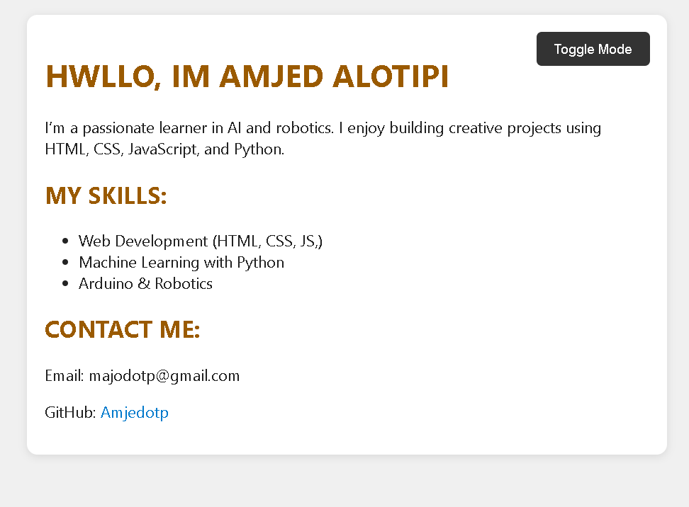

# About Me – Personal Web Page

This is a simple personal web page project built using **HTML**, **CSS**, and **JavaScript**.  
The purpose of this project is to showcase a short personal introduction with a clean and responsive design.

##  Features

- Clean and responsive layout.
- Dark mode toggle with JavaScript.
- Simple and modern design.
- Easy to customize for any personal use.

##  Screenshot



##  Technologies Used

- HTML5
- CSS3
- JavaScript

##  How to Run

1. Clone or download the project.
2. Open `index.html` in any modern browser.
3. Or use **Live Server** extension in Visual Studio Code for a better experience.

##  Folder Structure

```
about-me-project/
│
├── index.html        # Main HTML page
├── style.css         # Styling (CSS)
├── script.js         # JavaScript file for dark mode toggle
├── screenshot.png    # Screenshot of the website after rendering
└── README.md         # Project overview and instructions
```
